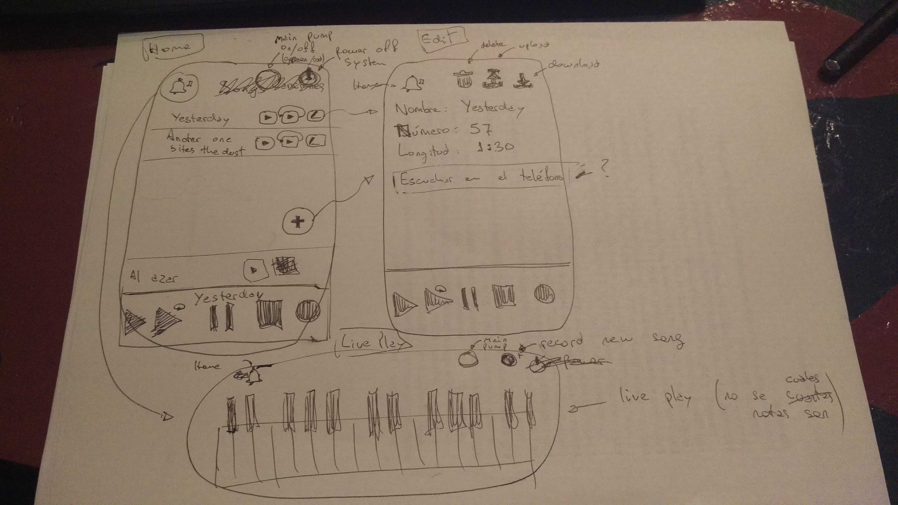

La idea es tener una aplicación Web que sea accesible desde un teléfono para poder controlar el carrillón.

La funcionalidad básica es tocar canciones, y permitir grabar canciones. También seriviría tener una
utilidad para poder probar GPIO por GPIO, que podría usarse para tocar en vivo, pero dudo que sirva
por los delays. Ya veremos, quizás se puede hacer algo para que no sea tan lenta la respuesta.

También tiene que ser posible seguir usando el sistema sin necesidad de conectarse, aunque
se pierda funcionalidad. Hay un teclado (musical) conectado a la raspi y ahora se usa eso
como control para disparar las acciones.

Cuatro pantallas en la App

* Home
* Edit (song)
* Live Play
* Settings

## Home

Tiene una lista de canciones y unos controles básicos para apagar el sistema, prender y apagar
una bomba principal que hay, y para tocar (play) o editar una canción. La lista de canciones
tiene un scroll, supongo.

Abajo siempre hay un player (play, play loop, pause, stop, record o (+) ).

* El + agrega una nueva canción y va a la pantalla de edición (podría estar solamente en los
controles inferiores, quizás mejor)
* El ícono de Edit en cada canción es para editar la metadata de la canción.
* El triangulito en cada canción la toca una vez.
* El triangulito con loop, la toca en loop
* El botón de la campanita va a "Live Play"
* La tuerca (ícono) va a settings
* El ícono circular al lado del power sirve para prender y apagar la bombá de aire principal (cambia de color)
* El Power apaga la raspi
* Hay una "canción" virtual que genera campanazos al azar por 15 segundos)
* Campanita arriba a la izquierda va a Live Play

Esto ya se podría hacer (salvo lo de "live play").

Tal cual la aplicación vieja, cuando elijen Play, ejecuta `aplaymidi` y cuando stop, mata el proceso.
Si eligen loop play ejecuta `loopplay.sh`. 

## Edit

Permite editar la metadata de una canción

* Campanita arriba a la izquierda, vuelve a Home
* Tachito de basura para borrar la canción
* Upload y Download para subir y bajar .mid 
* _Nombre_: Nombre de la canción. El default es la fecha y hora de grabación
* _Tecla_: Cual tecla en el piano hace sonar esta canción (en nombre tipo Do#4)
* _Duración_: La duración (tiempo) de la canción
* _Escuchar en el teléfono_: Será posible un botón que pase el .mid a .wav para poder escucharlo en el teléfono?
* _Recortar_: Un botón que saque los espacios adelante y atrás, si es posible y fácil

La canción se graba siempre, al volver a la pantalla principal ya aparece en la lista.
Para cancelar, hay que apretar el tacho de basura.

En esta pantalla, el botón de record del control inferior empieza y termina de grabar (stop también termina).
Para grabar se toca en el teclado musical conectado a la raspi (usando `arecordmidi` simplemente)

## Live Play

Muestra un teclado musical y permite tocar, sobre todo para probar el sistema y hacer cosas simples.
Solo las teclas del rango asignado se muestran (hay que documentarlo)

* Campanita arriba a la izquierda, vuelve a Home
* Record permite grabar una canción tocando en el tecladito...
  Quizás al usar record no toca las campanas en vivo, si no que genera sonidos en el teclado?

## Settings

* Tocar cada hora (si/no)
* Tocar cada 1/4 de hora (si/no)
* Horario y días para tocar
* elegir que canción tocar cada hora
* no se que otros settings veremos

